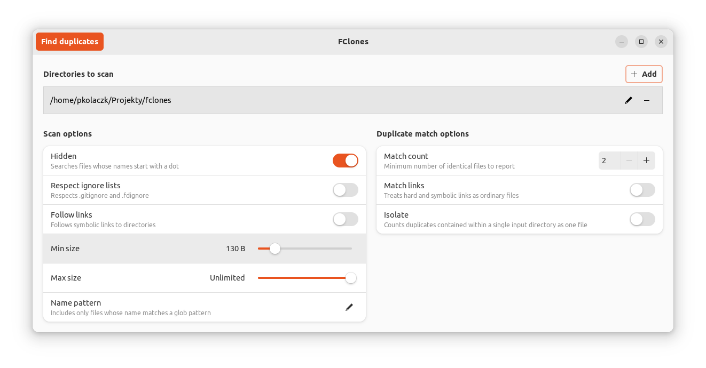
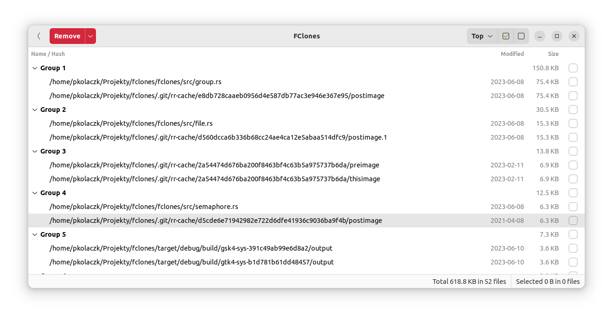

GUI for [fclones](https://github.com/pkolaczk/fclones)
=======================
**Fast interactive duplicate file finder and remover**

[](https://circleci.com/gh/pkolaczk/fclones-gui)
[](https://crates.io/crates/fclones-gui)
[](https://opensource.org/licenses/MIT)
---

Warning: This is a very early preview version.
Not all features of fclones are exposed.
This hasn't been thoroughly tested.




## Features

* Identifying groups of identical files
  - finding duplicate files
  - finding files with more than N replicas
  - scanning multiple directory roots
  - filtering names and paths by extended UNIX globs
  - filtering by min/max file size
  - proper handling of symlinks and hardlinks   
  - optional ignoring of files specified in `.gitignore`

* Removing redundant data 
  - removing, moving or replacing selected files with soft or hard links 
  - removing redundant file data using native copy-on-write (reflink) support on some file systems 
  - bulk selection of files to remove 
  - prioritizing files to remove by creation, modification, last access time or nesting level

* High performance 
  - parallel processing capability in all I/O and CPU heavy stages 
  - automatic tuning of parallelism and access strategy based on device type (SSD vs HDD)
  - low memory footprint thanks to heavily optimized path representation 
  - variety of fast non-cryptographic and cryptographic hash functions up to 512 bits wide 
  - doesn't push data out of the page-cache 
  - accurate progress reporting 
  - uses modern GTK4 list controls that can display hundreds thousands items

## Installation

Assuming you have Rust toolchain and GTK4 development libraries installed on your system,
you should be able to build it from source with the following command:

```shell
cargo install fclones-gui
```

## Usage
Should be self-explanatory. If it is not, then let me know by opening issues. ;)

Nevertheless, the workflow is as follows:

1. Select / add the directories you want to scan for duplicates.
2. Adjust options if needed.
3. Press the "Find duplicates" button. 
4. After search is complete, a list of file groups will be displayed.
5. Select files you want to get rid of. 
6. Select how you want to get rid of them, using the dropdown at the red button. 
7. Press the red button (warning: this *is* a destructive action).

You can remove duplicates many times without rerunning the search.
You can also go back to the input page and modify your scan settings.

## Reporting issues
Please report issues in GitHub Issues.
Don't forget to specify your OS and GTK4 version.
I've run into several GTK4 bugs while working with this project.
